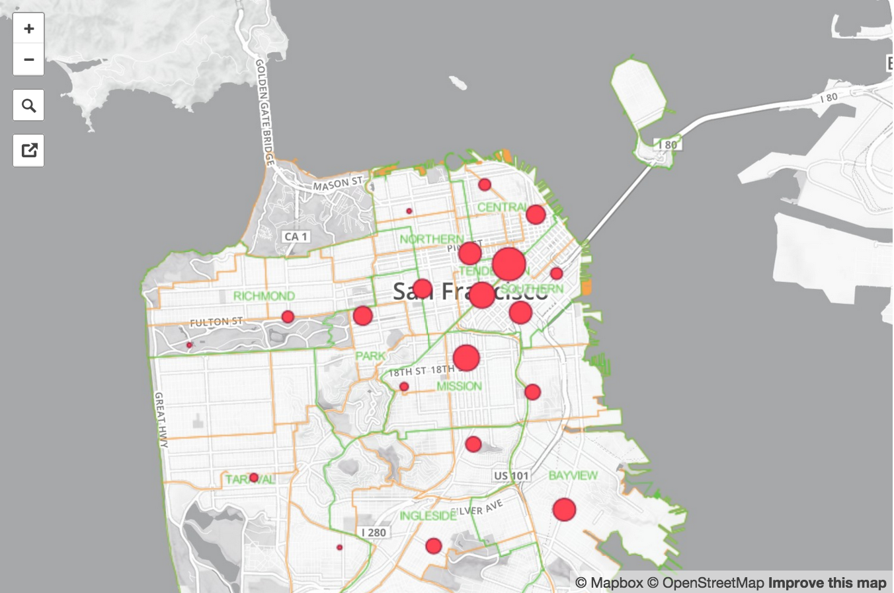

#crime-mapping
 
See blog and map at http://www.sarahmakesmaps.com/blog/2015/1/clustering-san-francisco-crime-data
 

 
clustering with K means, approach from: https://datasciencelab.wordpress.com/2013/12/12/clustering-with-k-means-in-python/
 
Styling with mapbox <3
